# Shell Scripting

*Demonstration of how to onboard 11 new Linux users into a server. This process will be automated using shell scripts. The source code used on this project was retrieved from darey.io.*

*Instructions on how to launch and connect to your EC2 instance using an SSH client:*

https://github.com/Antonio447-cloud/MEAN-stack-angular

    Happy learning!

## Onboarding 11 Linux Users into a Server

We will use shell scripts to automate the process of onboarding 11 linux users into a server. We will be doing that by creating a shell script that reads a ".csv file" or "comma-separated values file" that contains the first name of the users to be onboarded.

So, first before launching our EC2 instance we change directories to the same directory where we have our private key (.pem file) and we create a file called "onboard.sh":

`cd Documents`

`vim onboard.sh`

We input/paste the following code into it:

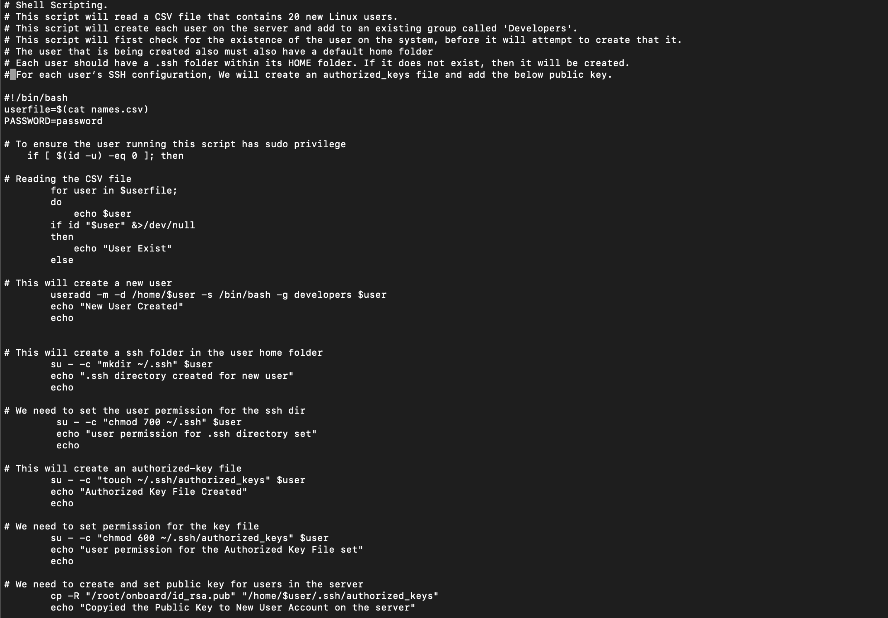

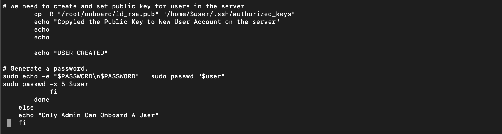

Now, we copy our "onboard.sh" file to our EC2 instance:

`scp -i <private-key> -r onboard.sh ubuntu@<ipv4>:~/`

Then we connect to our EC2 instance:

`ssh -i "<private-key>" ubuntu@<ipv4>`

We generate our SSH key pair:

`ssh-keygen`

We press "enter" to save the key pair to our home directory and press "enter" again for no passphrase. Then we change directories and list our files:

`cd ~/.ssh`

`ls`

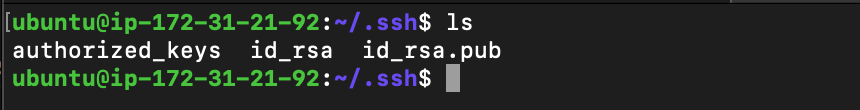

Then we check our public and private keys by running :

`cat id_rsa.pub`

`cat id_rsa`

We copy both keys into our notepad. Then we change directories and create a new directory called '"Shell":

`cd ..`

`mkidr Shell`

Then we move the onboard.sh file to the Shell folder:

`$ mv onboard.sh /home/ubuntu/Shell/`

We change directories to the "Shell" folder:

`cd Shell`

We create an "id_rsa", a "id_rsa.pub" and a "name.csv" file.

`touch id_rsa id_rsa.pub names.csv`

We open the id_rsa.pub file:

`vim id_rsa.pub`

We paste the public key that we copied into our notepad a minute ago into the id_rsa.pub file:

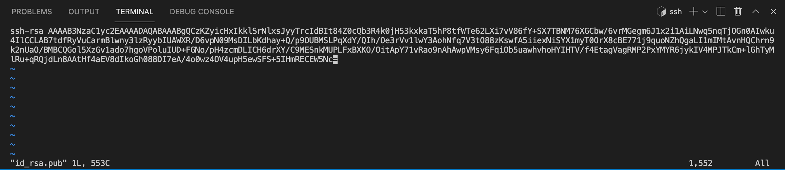

**NOTE**: *Do not forget to delete the public key from your notepad.*

Then we paste the private key that we copied into our notepad a minute ago into the id_rsa. file:

`vim id_rsa`

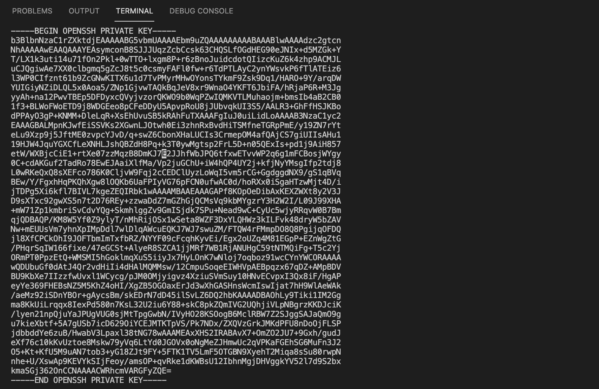

**NOTE**: *Do not forget to delete the private key from your notepad.*

We go into our names.csv file:

`vim names.csv`

We insert randon names in it:

 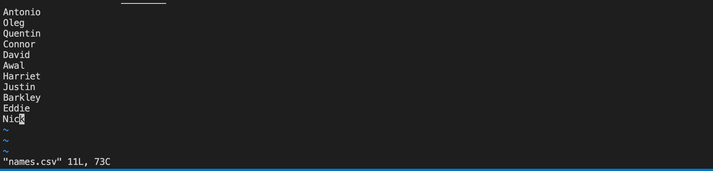

 Then we go into our "onboard.sh" file:

 `vim onboard.sh`

 We change the path that is on the onboard.sh file from from "/root/onboard/id_rsa.pub" to "/home/ubuntu/Shell/id_rsa.pub". To do that we press "/" then we type: "/root/onboard/id_rsa.pub" to take us into that line and we replace it with: /home/ubuntu/Shell/id_rsa.pub:

 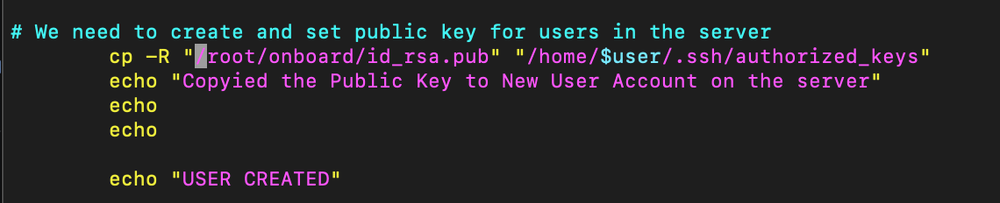

Changed:

 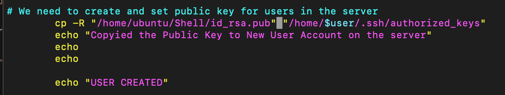
 
 We save and create the developers group:

`sudo groupadd developers`

Then we make the onboard.sh file executable:

`sudo chmod +x onboard.sh`

We switch to root user inside the Shell folder:

`sudo su`

As root user, we run the script:

`./onboard.sh`

Then we verify that the Linux users were created:

`ls -l /home/`

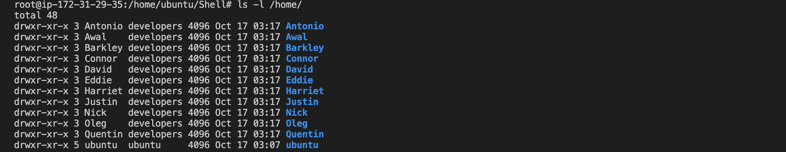

We check that the developers group was created too:

`getent group developers`

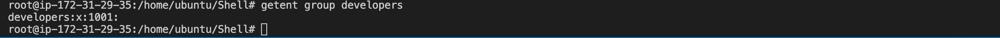

We verify that the developers' id "1001" matches with the Linux users' ID:

`cat /etc/passwd`

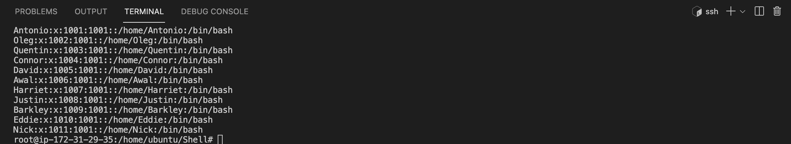

To view this with a more legible layout (usually used for data analysis) we run:

`cat /etc/passwd | awk -F':' '{print $1}' | xargs -n1 groups`

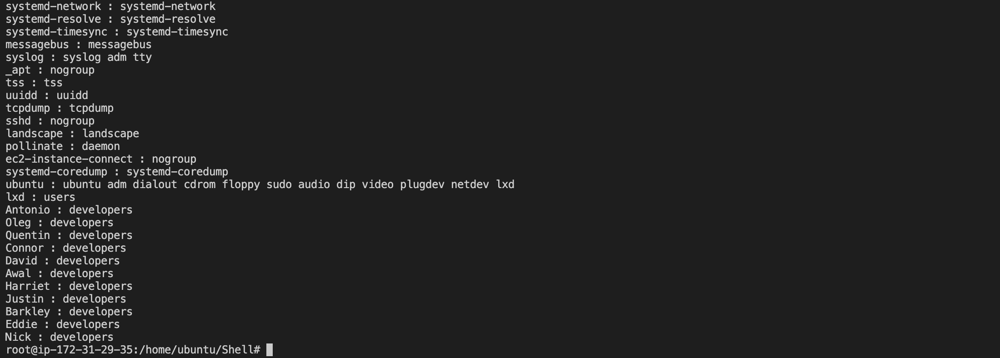

We can test a few of the users randomly. So, let's create a new terminal tab where we are not connected to our EC2 instance. Then we change directories to where we have our EC2 instance's private key:

`cd Documents`

Then we create a new file called "shell-scripting.pem" and we paste our "id_rsa" private key into it:

`vim shell-scripting.pem` 

Now we test the shell script by connecting as "Antonio" one of the Linux users that we have just created using our shell script. But before we do that, we need to protect our private key. So we run:

`sudo chmod 600 shell-scripting.pem`

Now we connect as "Antonio":

`ssh -i shell-scripting.pem Antonio@<ipv4>`

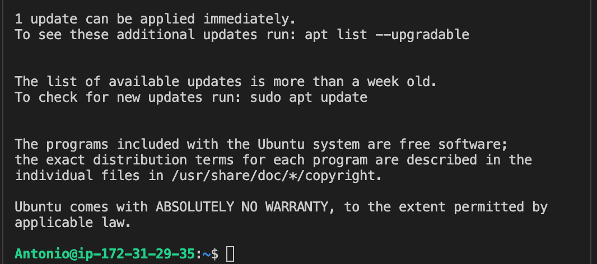

We have just onboarded 11 new Linux users into a server while automating the process using a shell script!